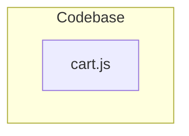

# Architecture Documentation

## System Overview

The codebase consists of a single standalone module: `cart.js`. Based on the provided dependency analysis, there are no external dependencies, internal module dependencies, or additional components interacting with this file.

## Component Breakdown

### `cart.js`
- **Type**: JavaScript Module
- **Dependencies**: None (`[]`)
- **Entities**: `cart.js`
- **Description**: Represents the primary component within the current codebase structure. It operates as an isolated file with no downstream or upstream dependencies mapped in the system graph.

---

## Dependency & Interaction Diagram

The following Mermaid diagram illustrates the module structure of the codebase. As there are no external or internal dependencies mapped, `cart.js` exists as a standalone node.

---

## Dependency Matrix

| File | Depends On | Internal Entities |
| :--- | :--- | :--- |
| `cart.js` | *None* | `cart.js` |